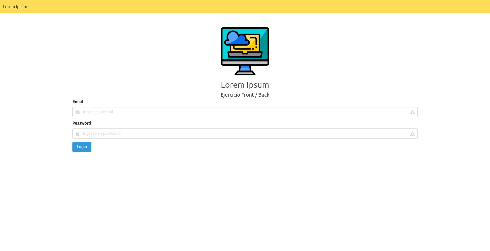
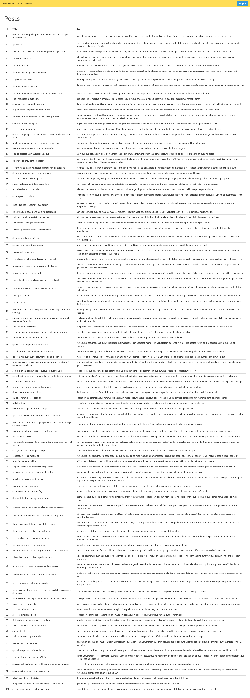
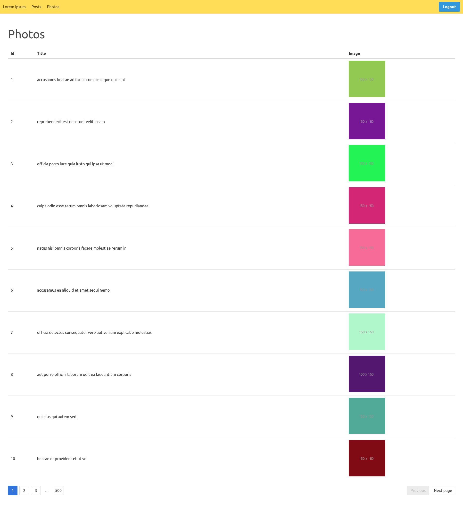
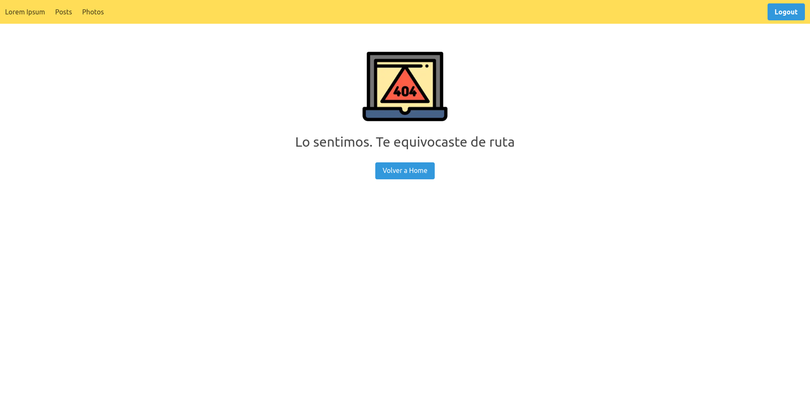

 <link rel="stylesheet" href="https://cdn.jsdelivr.net/gh/devicons/devicon@v2.11.0/devicon.min.css">
 

# Ejercicio de Frontend / Backend

## Ejercicio técnico realizado para una empresa de tecnología como parte de un proceso de selección de Desarrollador Full Stack Javascript.

### Descripción:

Crear 2 proyectos 1 llamado “Front” y otro llamado “Back”. El proyecto de Front será creado con React, mientras que en el Proyecto de Back deberá ser creado con Express de Node, el cual brindara una API REST JSON.

1. Login el cual debe consumir un servicio de login que debe ser creado en el proyecto de Back.
2. Listar [post], el cual debe consumir a la API : https://jsonplaceholder.typicode.com/posts y mostrarlo en una lista o tabla.
3. Listar [photos], el cual debe consumir a la API : https://jsonplaceholder.typicode.com/photos, esta lista debe tener paginación de 10 en 10, haciendo uso de limit and offset.

Todos los llamados a api deben ser a través del back, no directamente desde las url solicitadas. Hacer uso de JWT para el proceso de autenticación.

<b>Agregado personal:</b>

-   Agregar un proceso en el cual el usuario pueda registrarse en el sistema.
-   Realizar test con Jest.

### Tecnologías aplicadas en este caso particular:

<b>Frontend:</b>

<i class="devicon-react-original"></i>
<i class="devicon-redux-original"></i>
<i class="devicon-nextjs-original"></i>

-   ReactJS (librería base del proyecto)
-   Bulma (framework CSS)
-   Redux (manejo de estados globales)
-   Next (server-side rendering y routing)
-   React Cookie (manejo de cookies)
-   Axios (peticiones externas)
-   React Hook Form (formulario de inicio de sesión)

<b>Backend:</b>

<i class="devicon-nodejs-plain"></i>
<i class="devicon-express-original-wordmark"></i>
<i class="devicon-mongodb-plain-wordmark"></i>

-   NodeJS (entorno de ejecución principal)
-   Express (ruteo y manejo de peticiones)
-   Morgan (visualización de llegada de peticiones al servidor)
-   Nodemon (monitoreo de cambios en el código)
-   Axios (peticiones externas)
-   CORS (habilitación de peticiones hechas desde un sitio externo)
-   Dotenv (uso de variables de entorno)
-   JSON Web Tokens (creación y administración de tokens)
-   Sequelize (ORM inicial para trabajar en una base de datos MySQL, ver más adelante)
-   Mongoose (ORM para usar MongoDB, ver más adelante)

### Consideraciones:

-   En el feedback hecho por la empresa se corrigieron varios puntos:
    -   Se utilizó MySQL y se debería haber usado MongoDB. Este punto no fue aclarado en el ejercicio original y opté por usar MySQL ya que considero que se acostumbra a guardar información vinculada a usuarios en bases de datos relacionales ya que después se relacionará con otras actividades que realizará el mismo. Por eso en principio se utilizó Sequelize y en el cambio de motor de base de datos a MongoDB se usa Mongoose.
    -   Encriptación de contraseña. Al no haber un punto específico respecto al registro de datos se optó por no recurrir a la encriptación. Con el agregado de la funcionalidad de registro se utiliza Bcrypt.
    -   Validación de datos del lado del servidor. No lo consideré necesario por los fines del ejercicio y por los tiempos brindados. Fue agregado.
    -   Personalmente considero que realicé el ejercicio según los requerimientos, con diversos agregados que no excedieran lo que debía hacer. Estuve de acuerdo con algunas correcciones salvo en el caso de uso de una base de datos no especificada, la encriptación de datos cuando no se solicita un proceso de registros, el "no uso" de componentes en frontend cuando claramente se usaron siempre que fue necesario (por lo menos desde el punto de vista de un Junior) y el diseño sencillo del sitio (no se solicitó ninguna pauta en cuanto al diseño ni siquiera en la solicitud de empleo, sobre todo cuando buscaban un Desarrollador Full Stack Javascript). La transcripción del ejercicio es tal cual lo solicitado (salvo el "agregado personal", el cual se aclara), así que se puede apreciar qué se pide realmente.
-   En caso de ir a una página incorrecta se muestra un mensaje 404 personalizado (ver Screenshots) y cuando falla el servidor se muestra un mensaje 500 también personalizado.

### Comandos a ejecutar

#### Frontend:

1. Mover a carpeta Frontend:

    <code>cd front</code>

2. Instalar dependencias:

    <code>npm install</code>

3. Modo desarrollador:

    <code>npm run dev</code>

    Modo producción:

    <code>npm run build</code>

4. Datos de inicio de sesión:

    <b>Email:</b> usuario@correo.com

    <b>Password:</b> 12345

    <small>NOTA: Intente realizar el login con datos incorrectos. Se visualizará un mensaje que diga que las credenciales son incorrectas.</small>

#### Backend:

1. Mover a carpeta Backend:

    <code>cd back</code>

2. Instalar dependencias:

    <code>npm install</code>

3. Ejecución con Nodemon:

    <code>npm run dev</code>

    Ejecución con Node:

    <code>npm start</code>

4. Crear .env de acuerdo a las variables de ejemplo en .env.example

    SERVER_PORT= Puerto del servidor de NodeJS

    DB_HOST= URL provista por Atlas o mongodb://localhost:27017/[nombreTabla] o el correspondiente a su base de datos local.

    JWT_SECRET= palabra clave secreta para realizar el token.

### Screenshots

Home:

Posts:

Photos:

Error 404:

Licencia: MIT
